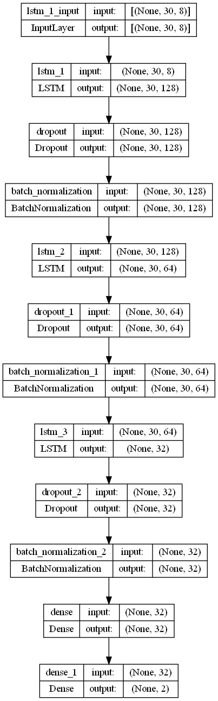

# Cryptocurrency using Multi-State LSTM
In this notebook, we analyze cryptocurrency datasets and define a problem to solve using multi-state LSTM

## Contents
### Data Understanding
There are four currencies and each currency has 6 features such as time, low, high, open, close and volume.

Currencies: BCH-USD, BTC-USD, ETH-USD, LTC-USD

### Data Cleaning
* Joining 4 datasets
* Handling missing values

Here we define a new dataframe and join 4 datasets into 1 dataset on time feature, then handle created NaN values.

### Problem Definition
We have 2 columns for each currency, close and volume, and we create a new column named "future" to store the LTC-USD_close value after 3 days.

**Problem:** Is it beneficial to buy LTC currency or not?

### Data Preprocessing
* Train-test split
  * We use the last 10 percent of data for testing and others for training
  

* Data to sequence
  * We divide the data into sequences with 30 time steps

* Under-sampling
  * The data is imbalanced, so we use this method to handle it
  

* Percentage change
* Min-max scaling

### Modeling

### Evaluation
The best val_accuracy is around 57%
